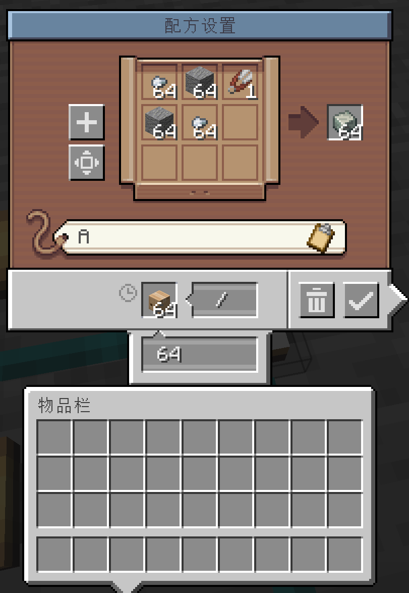
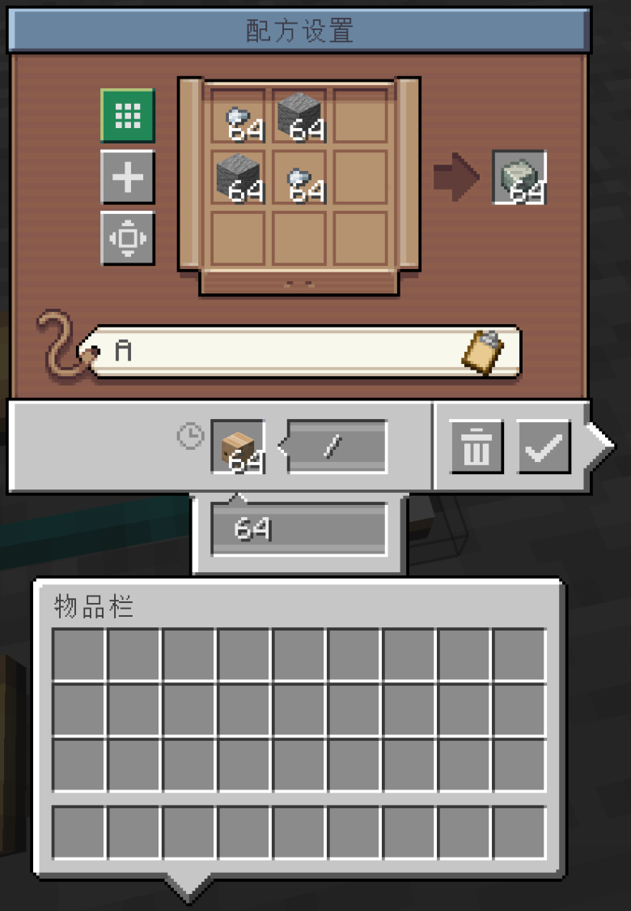
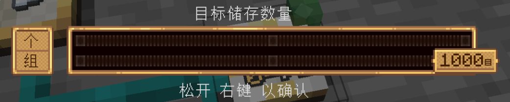

# Create: Better Factory Gauge

**Create: Better Factory Gauge** 是一个基于 **NeoForge** 的 [Create（机械动力）](https://modrinth.com/mod/create) 附属模组，为原版的 **工厂仪表（Factory Gauge）** 增加了更灵活的请求配置与批量合成功能。

> 本项目在编写过程中大量使用了 AI 辅助编程（代码生成、逻辑优化、文档撰写等）。

## 重要说明

- **备份存档**：在安装或使用本模组之前，请务必**备份你的游戏存档或世界文件夹**。尽管本模组经过单人测试，但仍可能存在未预见的 Bug 或数据异常。
- **多人模式**：本模组目前**没有**在多人环境（服务器或局域网联机）下进行过系统性测试。可能存在同步问题、数据包冲突或性能异常。建议在纯单人世界中使用，或在部署到服务器前自行进行充分测试。

## 主要功能

### 1️. 非合成模式 – 物品链接请求

在非合成模式下，你可以将**已添加链接的物品**（例如通过*物品栏*或*JEI*拖拽）放入工厂仪表。

### 2️. 合成模式 – 倍数请求

当工厂仪表处于**合成模式**时，你可以修改**单次请求的材料倍数**（默认为 1 倍）。

### 3. 目标存储数量

调整最大值为1000个/组

## 许可证

本项目采用 **MIT 许可证** – 你可以自由使用、修改、分发，包括用于整合包和服务器，但需保留原始版权声明。详见 [LICENSE](LICENSE) 文件。

## 鸣谢

- [Create 团队](https://github.com/Creators-of-Create) 提供了优秀的模组与 API。
- NeoForge 社区提供了强大的模组加载环境。
- 特别感谢 AI 辅助编程工具在开发过程中提供的代码建议、调试帮助和文档撰写支持。